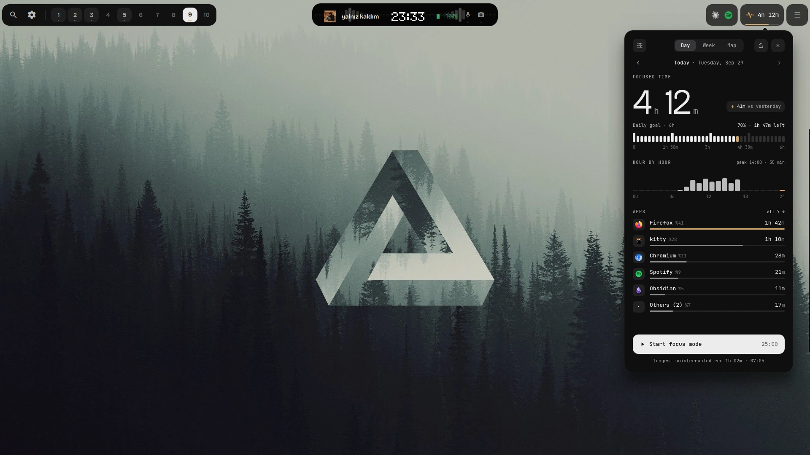
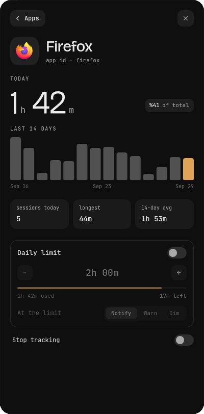
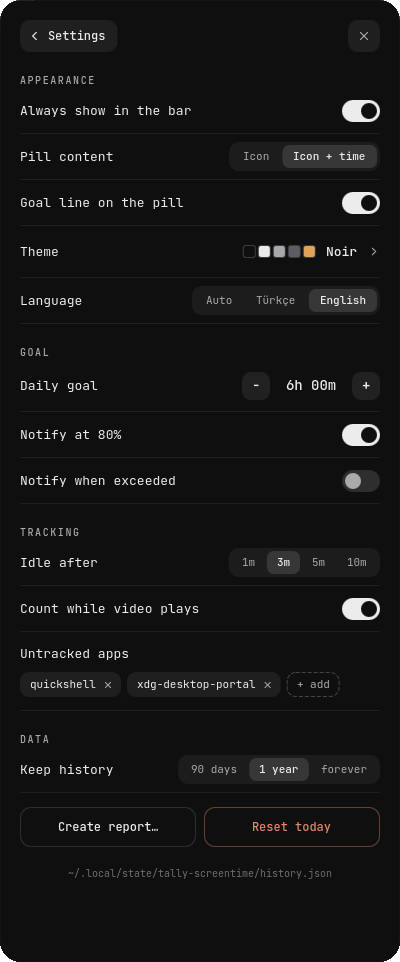
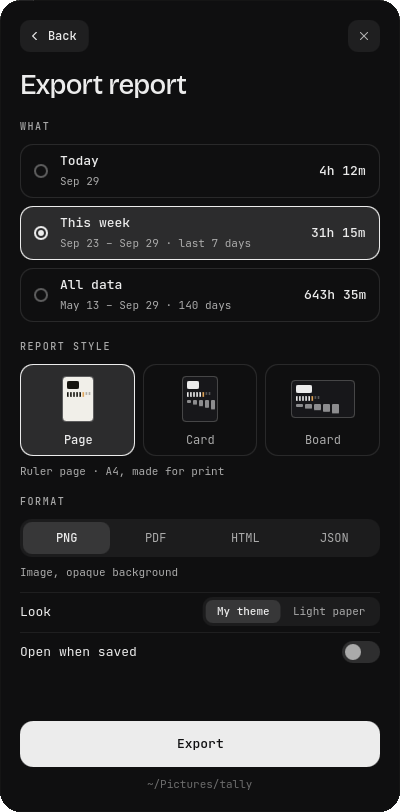
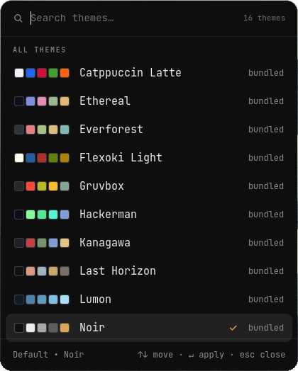
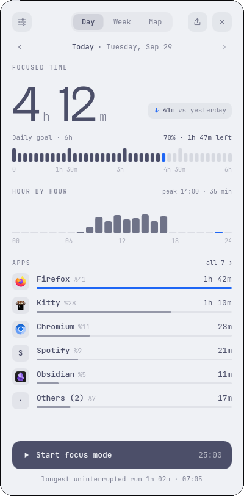
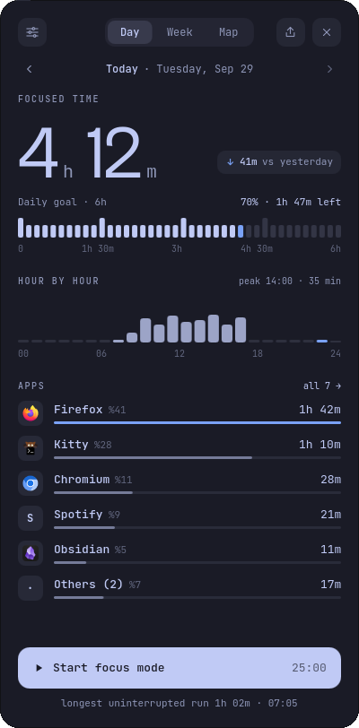

<div align="center">


# tally-screentime

Screen time for Quickshell on Hyprland: which apps you focus, for how long, against a daily goal — a pill on your bar and a card that hangs under it.

[](https://quickshell.outfoxxed.me/)
[](https://hyprland.org/)
[](LICENSE)

**[Website](https://lunanoir21.github.io/tally-screentime/)** · **[Interactive report demo](https://lunanoir21.github.io/tally-screentime/demo.html)** · [Türkçe README](README.tr.md)




<sub>The whole screen, uncropped: the pill sits in the bar, the card hangs under it. (Invented data.)</sub>

</div>

---

## What it is

Tally counts how long each window has focus, per app and per day, and shows it three ways:

- **Day** — the day's total against a goal drawn as a ruler of forty tick marks, hour by hour, and the top apps.
- **Week** — seven days as bars against the goal line.
- **Map** — sixteen weeks as a calendar heatmap, and the shape of an average week.

It is one Quickshell module: its own settings file, its own history file, no daemon and no background process. Everything the interface says is in Turkish or English.

## Features

**Counting that is honest**

- Only the focused window is counted. When you go idle (3 minutes by default) counting stops, **and the minutes before Tally noticed are taken back**, hour by hour.
- A video playing keeps counting (switchable). Suspend and clock jumps are never billed.
- Per app and per day: total, 24 hourly buckets, session counts, the longest uninterrupted run.

**Around the numbers**

- **Apps** — click one for its last fourteen days, its sessions, and an optional **daily limit**: notify, warn, or dim the screen.
- **Focus sessions** — twenty-five minutes; the pill becomes a countdown ring.
- **Back up and restore.** Settings → Data writes `~/tally-history.json`; *Restore* merges a backup (or a JSON report) back in — it adds the days you lack and only replaces a day with a fuller one, so importing twice changes nothing.
- **Notifications** at 80 % of the goal, when it is reached, and at each limit.
- **Sixteen themes** in a launcher-style picker with a live preview. A theme is three colours; everything else is mixed from them.
- **Turkish and English**, and a short first-run tour (skippable).

<p align="center">
  
  
  
</p>

<p align="center">
  
  
  
</p>

## Reports

The share icon in the card's header (or Settings → Data → *Create report…*) exports what you are looking at — a day, the last week, or everything:

| Format | What you get |
|---|---|
| **PNG** | a picture with an opaque background |
| **PDF** | one page, at the style's size (A4 for *Page*) |
| **HTML** | one self-contained interactive page |
| **JSON** | the report's raw data |

and, for PNG and PDF, one of three styles, drawn in the theme Tally is using or on light paper:

<p align="center">
  
  
  
</p>

*Page* is a ruled A4 sheet for print, *Card* is 1080 × 1350 for sharing, *Board* is 1600 × 900 with everything at a glance. Files land in `~/Pictures/tally/`; from the card you can open a report, show it in its folder, or copy a PNG to the clipboard. **Open when saved** does the first automatically.

The **HTML** report is one file — styles, script, fonts, app icons and data inside, no network. Hover a tile for its details (the bar for the busiest hour says so, and for how long); click a day and the hours and apps below switch to that day alone. A corner button flips between your theme and light paper, and it prints cleanly. [Try it.](https://lunanoir21.github.io/tally-screentime/demo.html)

Every number in a report comes from the same function that feeds the JSON export, and `tests/verify_report.py` re-derives them from `history.json` with separate code. Older history has no hourly buckets; a report says so instead of guessing.

## Install

Put the folder in your shell and add two lines.

```qml
// Shell.qml
import "vendor/tally/ui" as Tally

ShellRoot {
    Tally.TallyHost {}
}
```

```qml
// in your bar
Tally.TallyPill {
    size: barHeight          // the bar's height; the pill fills it
    radius: 14               // corner radius, to match the buttons around it
    barTop: 0                // offsets of the bar window, so the card's notch lines up
    barLeft: 0
    screenName: screen.name
    // chromeBase / chromeHover / chromeText take your bar's colours
}
```

Bind a key to the card:

```
bind = $mainMod, P, exec, qs ipc call lunanoir.tally-screentime toggle
```

To try it on its own, without a shell of your own: `quickshell -p /path/to/tally/Main.qml`.

Tally is installed as a folder, so there is nothing to build. PDF reports need `python3` with Pillow, or ImageMagick; *Copy* needs `wl-copy`; *Open* needs `xdg-open`; notifications need `notify-send`; the "follow the system" theme reads `gsettings`.

### IPC

`target lunanoir.tally-screentime`

| call | does |
|---|---|
| `open` / `close` / `toggle` | the card, on its Day page |
| `page <day\|week\|map\|apps\|settings\|focus\|export>` | open a page |
| `goto <page>` | change the page of an open card |
| `app <app-id>` | an app's page |
| `themes` | the theme picker |
| `settings` | the settings page |
| `focus` | start or show the focus session |
| `language <auto\|tr\|en>` | set the language |
| `backup` | write `~/tally-history.json` |
| `restore <path>` | merge a backup or a JSON report into the history |
| `onboarding <0-3>` | the first-run tour, from a step |
| `report <day\|week\|all> <page\|card\|board> <png\|pdf\|html\|json> <theme\|paper>` | make a report without opening the card |

## Cost

Measured, not promised. `tools/measure.py` starts a fresh Quickshell for each row (own state folder, a year of invented history, counting on) and reads the process's own counters over 45 seconds:

| | CPU (% of one core) | memory | wakeups / s |
|---|---:|---:|---:|
| empty Quickshell (one window) | 0.00 | 163 MB | 0.0 |
| **Tally, card closed** | **0.09** | **203 MB** | **0.5** |
| Tally, card open (Day) | 0.09 | 257 MB | 0.8 |
| Tally, card open + a focus session running | 0.27 | 214 MB | 22.1 |

So Tally on a bar, card closed, costs about **0.1 % of a core, 40 MB and half a wakeup per second** on top of Quickshell itself. Making a board report peaks at 287 MB (about 93 MB over before) and gives it back afterwards. The bookkeeping is tiny — on the engine Quickshell uses (`tests/bench_ledger.qml`): billing 15 seconds into a year of history takes **0.1 ms**, taking back idle time 0.07 ms, a week's report 0.2 ms, a whole year's 9 ms, serialising a year of history 3 ms.

The numbers are from one machine (Intel i5-12500H, Hyprland 0.56, Quickshell 0.3.1, a 1080p screen) and one run each; memory in particular moves by tens of megabytes between runs, and "wakeups" counts everything the process does, Qt's render thread included. The focus session is the expensive case because its clock repaints the card every second — it is the one to look at first if you want to trim. [The raw numbers](docs/data/measure.json).

What keeps it cheap:

- **No polling.** The tracker reacts to focus changes. While something is being counted, one 15 s timer commits the elapsed time; when you are idle, or in an excluded app, nothing runs.
- **Writes are rare.** History is written at most every 20 s, only if it changed, and once more when the shell exits.
- **Closed means gone.** The card, the theme picker and the report renderer are created when used and destroyed afterwards; a closed Tally holds no window.
- **The shadow** under the card is cast by a plain silhouette, so its blur is rendered once, not every time the contents change.
- **The pill** is a rectangle, a path and a text. It updates when the total does (every 15 s) and once a second during a focus session.

## Data

`~/.local/state/tally-screentime/`

- `settings.json` — theme, language, goal, pill content, notifications, idle time, excluded apps, retention, per-app limits.
- `history.json` — per day: total, per-app time, 24 hourly buckets, per-app session counts, the longest uninterrupted run.

On first run, an existing `~/.local/state/pulse-screentime/history.json` (Tally's predecessor) is copied over. Nothing leaves your machine.

## Development

```sh
tests/run.sh
```

runs the Qt Quick tests (`tests/tst_*.qml`: formatting, the bookkeeping that bills time to hours and days, the report builder and the HTML assembly — against hand-made histories) and the Python ones (`tests/test_*.py`: the PDF writer, the icon finder, the demo history, the HTML report's assets, and a check that no Turkish text hides outside `Str.qml` and every `Str.*` the UI reads exists). It needs Qt 6's `qmltestrunner`.

Environment variables, for tests and screenshots:

| | |
|---|---|
| `TALLY_STATE_DIR` | read and write another folder instead of `~/.local/state/tally-screentime` |
| `TALLY_DEMO=1` | show the history that is there, count nothing, write nothing |
| `TALLY_EXPORT_DIR` | where reports go, instead of `~/Pictures/tally` |
| `TALLY_KEEP_OPEN=1` | the card ignores clicks outside it (for measuring) |

`tools/measure.py` measures the cost (above), `tools/make_demo_history.py` writes an invented history (that is how the pictures above were made), `tools/make_html_fonts.py` rebuilds the HTML report's inlined fonts, `tools/find_icons.py` and `tools/img2pdf.py` are what reports call.

The website is `docs/` (GitHub Pages: *Settings → Pages → Deploy from a branch → `/docs`*).

## Fonts

JetBrains Mono and Bricolage Grotesque, both SIL OFL 1.1, are bundled in `ui/fonts`; the HTML report carries small subsets of them.

## License

MIT. The bundled fonts keep their own licenses.
