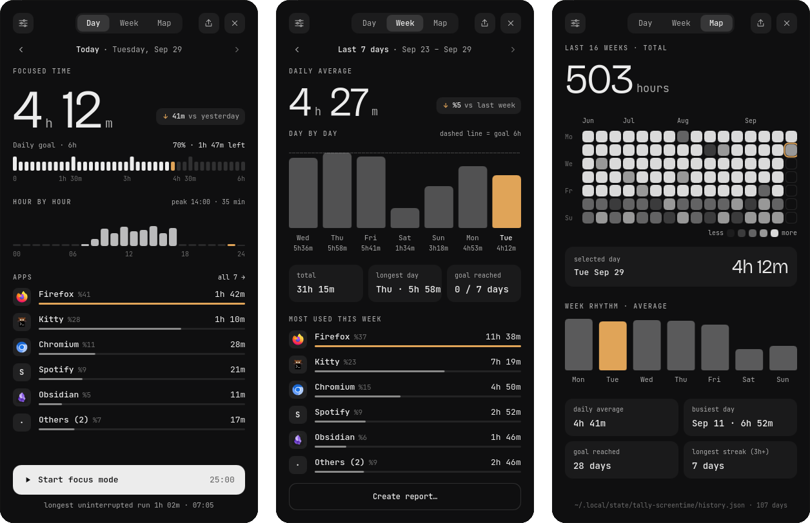
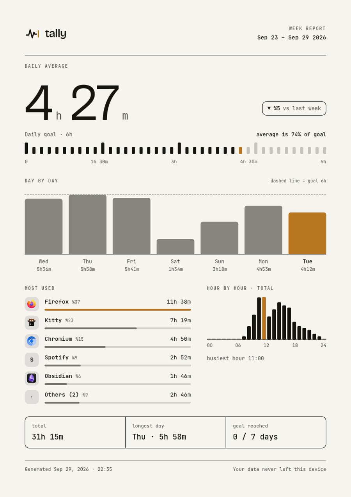
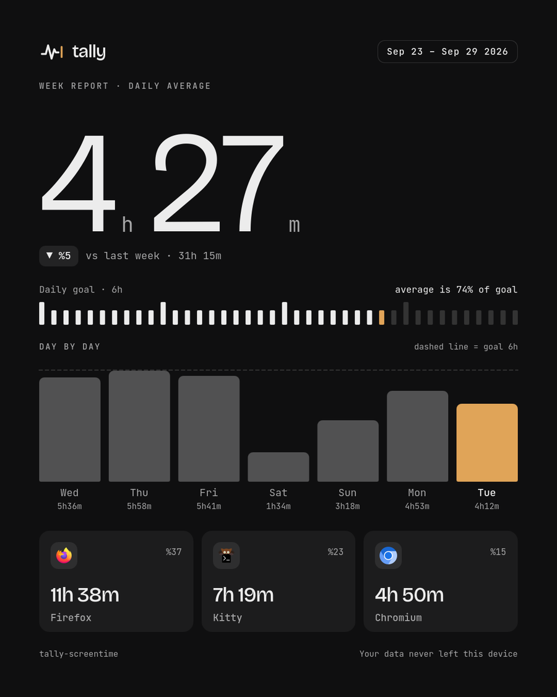
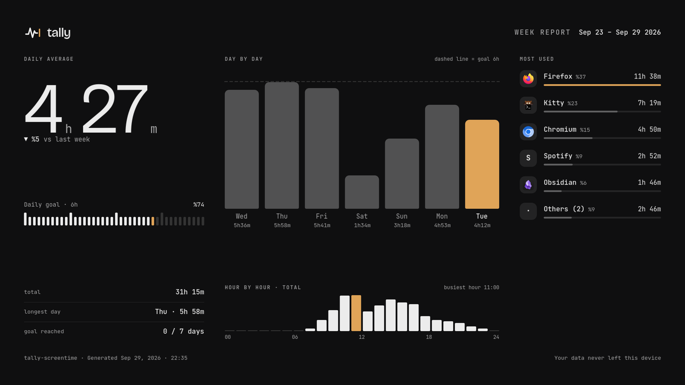

<div align="center">


# tally-screentime

Hyprland üzerinde Quickshell için ekran süresi: hangi uygulamaya ne kadar odaklandığın, günlük hedefine göre — bar'da bir pill ve altında sarkan bir kart olarak.

**[Web sitesi](https://lunanoir21.github.io/tally-screentime/)** · **[Etkileşimli rapor demosu](https://lunanoir21.github.io/tally-screentime/demo.html)** · [English README](README.md)



</div>

---

## Ne yapar

Tally, her pencerenin odakta kaldığı süreyi uygulama ve gün bazında sayar:

- **Gün** — günün toplamı, 40 çentikli hedef cetveli, saat saat dağılım, en çok kullanılan uygulamalar.
- **Hafta** — yedi gün, hedef çizgisiyle çubuklar halinde.
- **Harita** — on altı haftalık takvim ısı haritası ve bir haftanın ortalama şekli.

Tek bir Quickshell modülüdür: kendi ayar dosyası, kendi geçmiş dosyası; arka plan servisi yok. Arayüz Türkçe ve İngilizce.

## Özellikler

- **Dürüst sayım.** Yalnızca odaktaki pencere sayılır. Boşta kalınca (varsayılan 3 dk) sayım durur ve **Tally'nin fark etmesinden önceki dakikalar geri alınır**. Uyku ve saat atlamaları hiç sayılmaz.
- **Uygulama sayfaları.** Son on dört gün, oturum istatistikleri ve isteğe bağlı **günlük sınır** (bildir, uyar ya da ekranı karart).
- **Yedekle / geri yükle.** Ayarlar → Veri, `~/tally-history.json` dosyasını yazar; *Geri yükle* bir yedeği (ya da JSON raporu) geçmişe birleştirir — olmayan günleri ekler, bir günü ancak daha dolu olanla değiştirir; aynı yedeği iki kez içe aktarmak hiçbir şeyi değiştirmez.
- **Odak oturumları.** 25 dakika; pill geri sayım halkasına dönüşür.
- **On altı tema**, canlı önizlemeli seçici. Bir tema üç renktir.
- **Türkçe / İngilizce** ve atlanabilir bir ilk açılış turu.

## Raporlar

Kartın başlığındaki paylaş ikonundan (ya da Ayarlar → Veri → *Rapor oluştur…*) bir günü, son haftayı ya da tüm veriyi dışa aktar:

| Biçim | Ne verir |
|---|---|
| **PNG** | opak arka planlı görsel |
| **PDF** | tek sayfa, seçilen türün boyutunda (*Sayfa* için A4) |
| **HTML** | tek dosyalık etkileşimli sayfa |
| **JSON** | raporun ham verisi |

PNG ve PDF için üç tür var — *Sayfa* (çizgili A4, yazdırmak için), *Kart* (1080 × 1350, paylaşmak için), *Pano* (1600 × 900) — Tally'nin temasıyla ya da açık kâğıda çizilir.

<p align="center">
  
  
  
</p>

**HTML** rapor tek dosyadır (stiller, betik, yazı tipleri, uygulama simgeleri ve veri içinde; ağ yok). Bir karenin üzerine gelince ayrıntısı çıkar — en yoğun saatin çubuğu bunu ve süresini söyler; bir güne tıklayınca alttaki saat ve uygulamalar yalnızca o günü gösterir. Köşedeki düğme temanla açık kâğıt arasında geçiş yapar. Dosyalar `~/Pictures/tally/` altına yazılır; **Kaydedince aç** seçeneği raporu hemen açar.

Raporlardaki her sayı JSON dışa aktarmayla aynı fonksiyondan gelir; `tests/verify_report.py` bunları `history.json`'dan ayrı bir kodla yeniden hesaplar.

## Kurulum

```qml
// Shell.qml
import "vendor/tally/ui" as Tally

ShellRoot {
    Tally.TallyHost {}
}
```

```qml
// bar'ında
Tally.TallyPill {
    size: barHeight
    radius: 14
    barTop: 0
    barLeft: 0
    screenName: screen.name
}
```

```
bind = $mainMod, P, exec, qs ipc call lunanoir.tally-screentime toggle
```

Denemek için: `quickshell -p /path/to/tally/Main.qml`. PDF için `python3` + Pillow ya da ImageMagick gerekir. IPC komutlarının tam listesi ve geliştirme notları için [README.md](README.md).

## Maliyet

Söz değil, ölçüm. `tools/measure.py` her satır için yeni bir Quickshell başlatır (ayrı durum klasörü, bir yıllık uydurma geçmiş, sayım açık) ve sürecin kendi sayaçlarını 45 saniye okur:

| | CPU (tek çekirdeğin %'si) | bellek | uyanma / sn |
|---|---:|---:|---:|
| boş Quickshell (tek pencere) | 0.00 | 163 MB | 0.0 |
| **Tally, kart kapalı** | **0.09** | **203 MB** | **0.5** |
| Tally, kart açık (Gün) | 0.09 | 257 MB | 0.8 |
| Tally, kart açık + odak oturumu | 0.27 | 214 MB | 22.1 |

Yani bar'da, kart kapalıyken Tally Quickshell'in üstüne yaklaşık **çekirdeğin %0,1'i, 40 MB ve saniyede yarım uyanma** ekler. Pano raporu çizilirken bellek 287 MB'a çıkar (yaklaşık 93 MB fazla) ve sonra geri verir. Kayıt tutma işi çok küçüktür: bir yıllık geçmişe 15 saniye işlemek 0,1 ms, bir yıllık rapor 9 ms sürer (`tests/bench_ledger.qml`).

Sayılar tek makineden (Intel i5-12500H, Hyprland 0.56, Quickshell 0.3.1, 1080p) ve her biri tek çalıştırmadandır; bellek çalıştırmalar arasında onlarca MB oynar. Pahalı olan durum odak oturumudur: saati kartı her saniye yeniden çizer. Ham sayılar: [docs/data/measure.json](docs/data/measure.json).

## Veri

`~/.local/state/tally-screentime/` altında `settings.json` ve `history.json`. Hiçbir şey makinenden çıkmaz.

## Testler

`tests/run.sh` — Qt 6 `qmltestrunner` ve `python3` gerekir.

## Lisans

MIT. Paketlenen yazı tipleri (JetBrains Mono, Bricolage Grotesque — SIL OFL 1.1) kendi lisanslarını korur.
